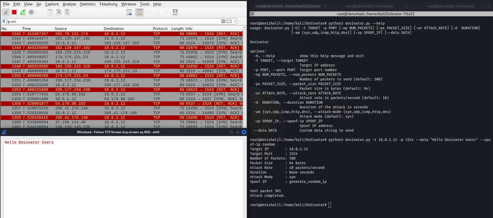

# DoSinator
DoSinator is a versatile Denial of Service (DoS) testing tool developed in Python. It empowers security professionals and researchers to simulate various types of DoS attacks, allowing them to assess the resilience of networks, systems, and applications against potential cyber threats.



## Features

- **Multiple Attack Modes**: DoSinator supports SYN Flood, UDP Flood, and ICMP Flood attack modes, allowing you to simulate various types of DoS attacks.
- **Customizable Parameters**: Adjust the packet size, attack rate, and duration to fine-tune the intensity and duration of the attack.
- **IP Spoofing**: Enable IP spoofing to mask the source IP address and enhance anonymity during the attack.
- **Multithreaded Packet Sending**: Utilize multiple threads for simultaneous packet sending, maximizing the attack speed and efficiency.

## Requirements

- Python 3.x
- scapy
- argparse

## Installation

1. Clone the repository:

   ```shell
   git clone https://github.com/HalilDeniz/DoSinator.git
   ```

2. Navigate to the project directory:

   ```shell
   cd DoSinator
   ```

3. Install the required dependencies:

   ```shell
   pip install -r requirements.txt
   ```

## Usage

```shell
usage: dosinator.py [-h] -t TARGET -p PORT [-np NUM_PACKETS] [-ps PACKET_SIZE]
                   [-ar ATTACK_RATE] [-d DURATION] [-am {syn,udp,icmp,http,dns}]
                   [-sp SPOOF_IP] [--data DATA]

optional arguments:
  -h, --help            Show this help message and exit.
  -t TARGET, --target TARGET
                        Target IP address.
  -p PORT, --port PORT  Target port number.
  -np NUM_PACKETS, --num_packets NUM_PACKETS
                        Number of packets to send (default: 500).
  -ps PACKET_SIZE, --packet_size PACKET_SIZE
                        Packet size in bytes (default: 64).
  -ar ATTACK_RATE, --attack_rate ATTACK_RATE
                        Attack rate in packets per second (default: 10).
  -d DURATION, --duration DURATION
                        Duration of the attack in seconds.
  -am {syn,udp,icmp,http,dns}, --attack-mode {syn,udp,icmp,http,dns}
                        Attack mode (default: syn).
  -sp SPOOF_IP, --spoof-ip SPOOF_IP
                        Spoof IP address.
  --data DATA           Custom data string to send.
```

- `target_ip`: IP address of the target system.
- `target_port`: Port number of the target service.
- `num_packets`: Number of packets to send (default: 500).
- `packet_size`: Size of each packet in bytes (default: 64).
- `attack_rate`: Attack rate in packets/second (default: 10).
- `duration`: Duration of the attack in seconds.
- `attack_mode`: Attack mode: syn, udp, icmp, http (default: syn).
- `spoof_ip`: Spoof IP address (default: None).
- `data`: Custom data string to send.

## Disclaimer

The usage of the Dosinator tool for attacking targets without prior mutual consent is illegal. It is the end user's responsibility to obey all applicable local, state, and federal laws. The author assumes no liability and is not responsible for any misuse or damage caused by this program.

By using Dosinator, you agree to use this tool for educational and ethical purposes only. The author is not responsible for any actions or consequences resulting from misuse of this tool.

Please ensure that you have the necessary permissions to conduct any form of testing on a target network. Use this tool at your own risk.


## Contributing

Contributions are welcome! If you find any issues or have suggestions for improvements, feel free to open an issue or submit a pull request.

## Contact

If you have any questions, comments, or suggestions about Dosinator, please feel free to contact me:

- LinkedIn: [Halil Ibrahim Deniz](https://www.linkedin.com/in/halil-ibrahim-deniz/)
- TryHackMe: [Halilovic](https://tryhackme.com/p/halilovic)
- Instagram: [deniz.halil333](https://www.instagram.com/deniz.halil333/)
- YouTube: [Halil Deniz](https://www.youtube.com/c/HalilDeniz)
- Email: halildeniz313@gmail.com


## License
This project is licensed under the MIT License. See the [LICENSE](LICENSE) file for more details.

## 💰 You can help me by Donating
  Thank you for considering supporting me! Your support enables me to dedicate more time and effort to creating useful tools like DNSWatch and developing new projects. By contributing, you're not only helping me improve existing tools but also inspiring new ideas and innovations. Your support plays a vital role in the growth of this project and future endeavors. Together, let's continue building and learning. Thank you!"<br>
  [](https://buymeacoffee.com/halildeniz) 
  [](https://patreon.com/denizhalil) 

  
